# 📝 Case Study Overview
Kultra Mega Stores (KMS), a Nigerian mega store that has her headquarters in Lagos and has branches worldwide. and her client based include corporate clients (Wholesale), Small Businesses (retail) and individual consumers; is planning to grow her Abuja division. 
The analysis spans data from 2009 to 2012, and answers key business questions using Microsoft SQL Server, and as a Business Intelligence Analyst, I’ve been given the task to perform a comprehensive analysis on the given data, generate key insights and present my findings.

## 🎯 Objectives
  * Analyse the performance of products, regions, customers, and shipping performance between 2009 to 2012.
  * Provide insights to increase revenue and reduce costs

## 🗃️ Data Sources
  * CSV file with Customers information, products information and all shipping artilleries in all the branches from 2009 to 2012!
  * CSV file that contains returned orders status.

## 🧰 Tools Used
  Microsoft SQL Server

## 🏗️ Project Structure
### 🧹Data Exploratory
  Performed Basic Exploratory Data Analysis on the data set to understand the structure of the data set, Identify patterns or relationships, Detect outliers or errors, and generate hypothesis for further analysis or modeling.
### 🛢️Database
  The project started with creating of database named KMS_DB
  ```sql
CREATE DATABASE KMS_DB
```
## 📌Case Scenario
### 📍Scenario 1
  1. Product category with highest sales  
2. Top 3 and bottom 3 sales regions  
3. Total appliance sales in Ontario  
4. How to increase revenue from bottom 10 customers  
5. Most expensive shipping method  
### 📍Scenario 2
6. Most valuable customers and what they buy  
7. Small business customer with highest sales  
8. Corporate customer with most orders (2009–2012)  
9. Most profitable consumer customer  
10. Customers who returned items and their segment  
11. Did shipping methods(Express air and Delivery Truck) match the order priority?

## 🧠 Insight
### 📍Case Scenario 1
1. Product category with the highest sale
```sql
SELECT TOP 1 Product_Category, SUM(Sales) AS Total_Sales
FROM KMS_Inventory
GROUP BY Product_Category
ORDER BY Total_Sales DESC
```
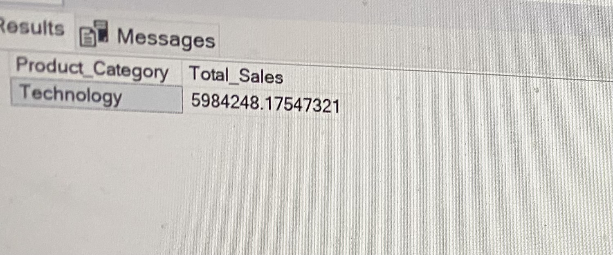

2. Top 3 and Buttom 3 sales region
* Top 3
 ```sql
 SELECT TOP 3 Region, SUM(Sales) AS Total_Sales
FROM KMS_Inventory
GROUP BY Region
ORDER BY Total_Sales DESC
```
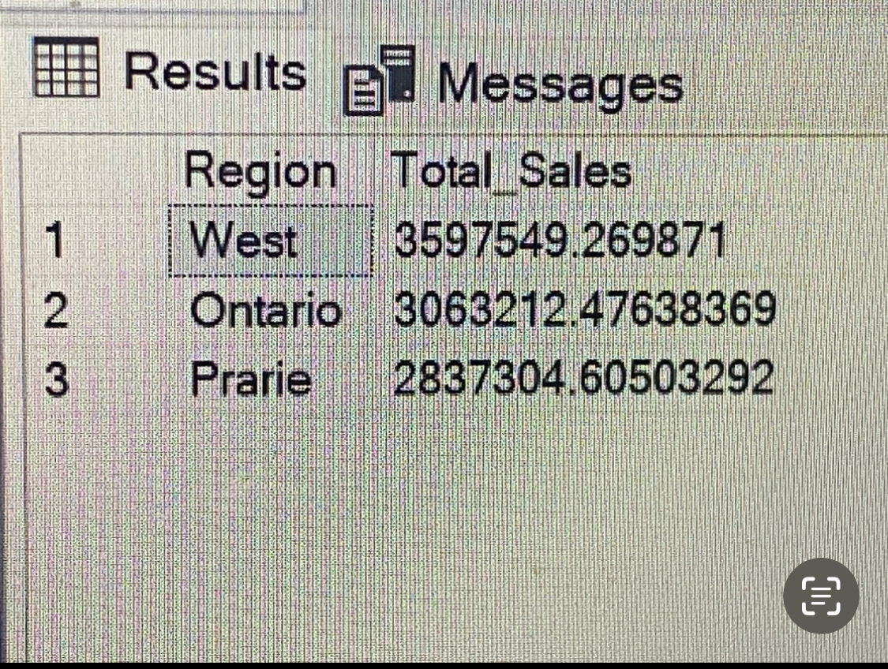

* Buttom 3
```sql
SELECT TOP 3 Region, SUM(Sales) AS Total_Sales
FROM KMS_Inventory
GROUP BY Region
ORDER BY Total_Sales ASC
```
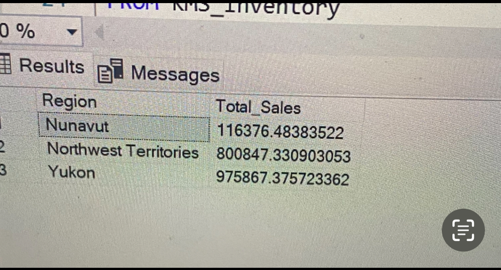

3. Total appliance sales in Ontario
```sql
SELECT SUM(SALES) AS Total_Sales 
FROM KMS_Inventory
WHERE Product_Category = 'Appliances'
AND Region = 'Ontario'
```
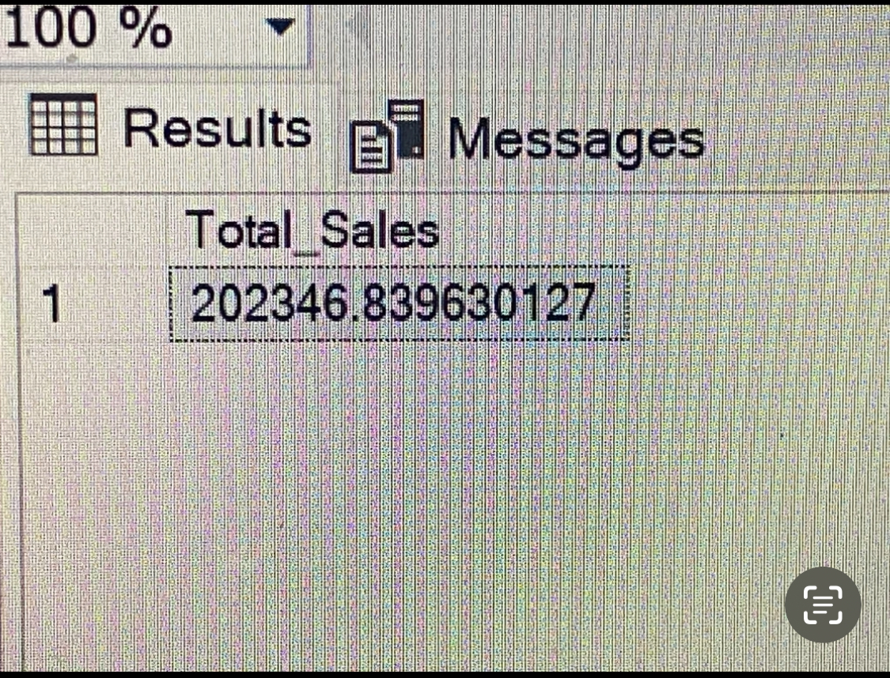

4. How to Increase revenue from buttom 10 customers
```sql
SELECT TOP 10 Customer_Name, 
SUM(Sales) AS Lowest_Customer_Sales, 
SUM(Profit) AS Total_Profit,
SUM(Shipping_Cost) AS Total_Shipping_Cost,
COUNT(Order_ID) AS Total_Order
FROM KMS_Inventory
GROUP BY Customer_Name
ORDER BY Lowest_Customer_Sales ASC
```
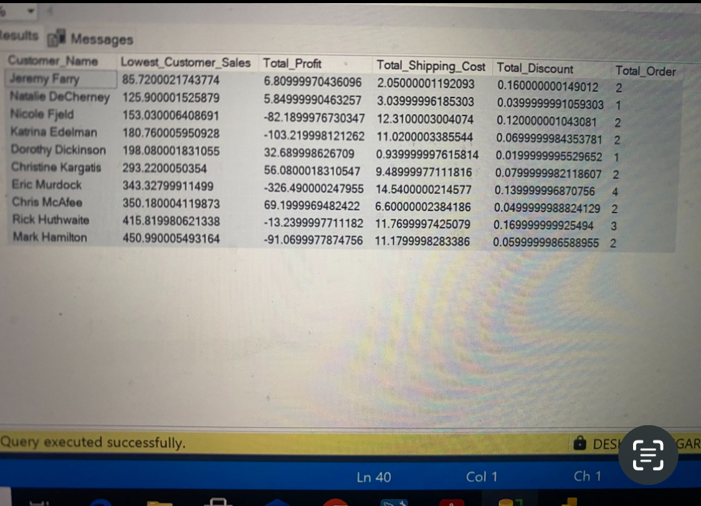

5. Most Expensive Shipping method
```sql
SELECT TOP 1 Ship_Mode, SUM(Shipping_Cost) AS Highest_Shipping_Cost
FROM KMS_Inventory
GROUP BY Ship_Mode
ORDER BY Highest_Shipping_Cost DESC
```
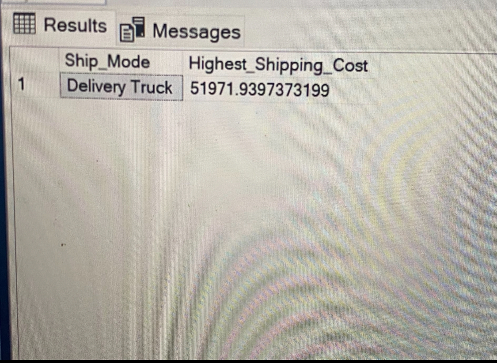

### 📍Case Scenario 2
6. Most Valuable customers with itens they bought 
```sql
-----STEP 1: GETING THE TOP 5 CUSTOMERS AND HOW MUCH THEY SPENT---
SELECT TOP 5 Customer_Name,
SUM(Sales) AS Highest_Spent,
COUNT(Order_ID) AS Total_Order
FROM KMS_Inventory
GROUP BY Customer_Name
ORDER BY Highest_Spent DESC

----STEP 2: USING SUBQUERRY TO JOIN THE TOP CUSTOMERS AND WHAT TEHY PURCHASED----
WITH Top_Customers AS
(SELECT TOP 5
Customer_Name,
SUM(Sales) AS Total_Spent
FROM KMS_Inventory ki
GROUP BY Customer_Name
ORDER BY Total_Spent DESC
)
SELECT ki.Customer_Name,
		ki.Product_Name,
COUNT(*) AS Purchase_Count,
SUM(ki.Sales) AS Total_Spent_On_Products
FROM KMS_Inventory ki
JOIN Top_Customers tc 
ON ki.Customer_Name = tc.Customer_Name
GROUP BY ki.Customer_Name, ki.Product_Name
ORDER BY Total_Spent_On_Products DESC
```
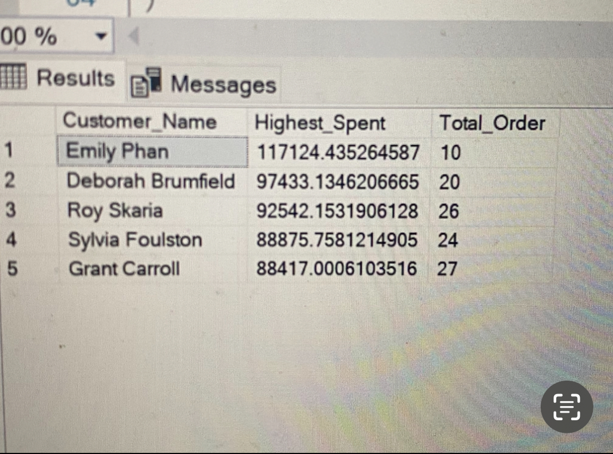
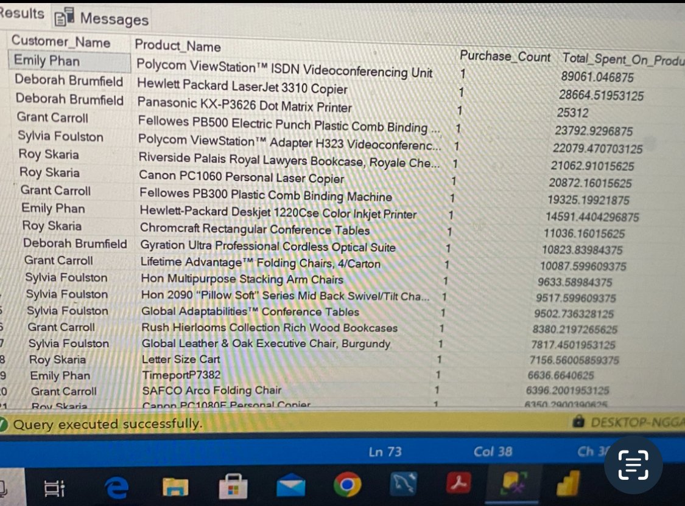

7. Small business with the highest sales
```sql
SELECT TOP 1 Customer_Name, SUM(Sales) AS Total_Sales
FROM KMS_Inventory
WHERE Customer_Segment = 'Small Business'
GROUP BY Customer_Name
ORDER BY Total_Sales DESC
```
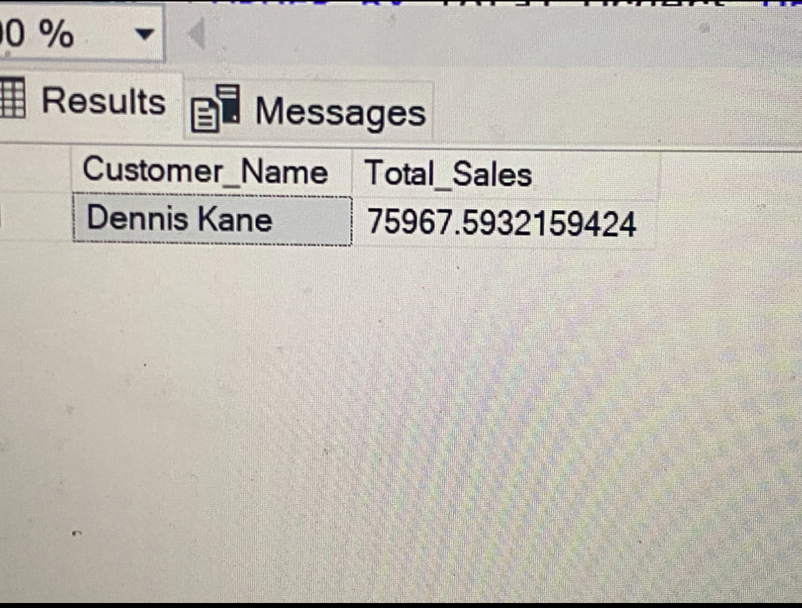

8. Corporate customer with most orders (2009-2012)
```sql
SELECT TOP 1 Customer_Name, 
COUNT (Order_ID) AS Total_Orders
FROM KMS_Inventory
WHERE Customer_Segment = 'Corporate' AND 
Order_Date BETWEEN '2009-01-01' AND '2012-01-01'
GROUP BY Customer_Name
ORDER BY Total_Orders DESC
```
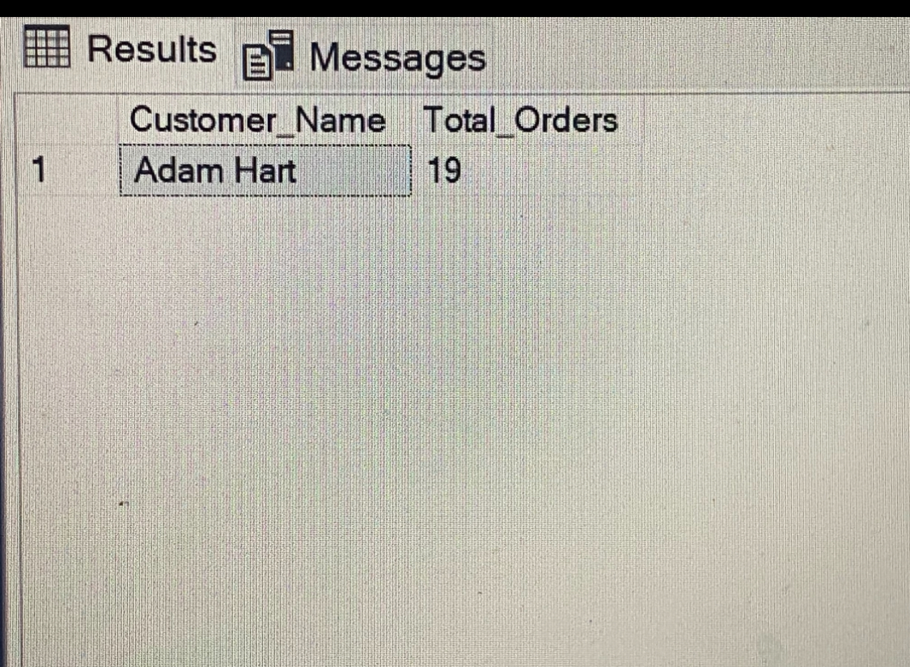

9. Most profitable consumer customer
```sql
SELECT TOP 1 Customer_Name, SUM(Sales) AS Total_Sales
FROM KMS_Inventory
WHERE Customer_Segment = 'Consumer'
GROUP BY Customer_Name
ORDER BY Total_Sales DESC
```
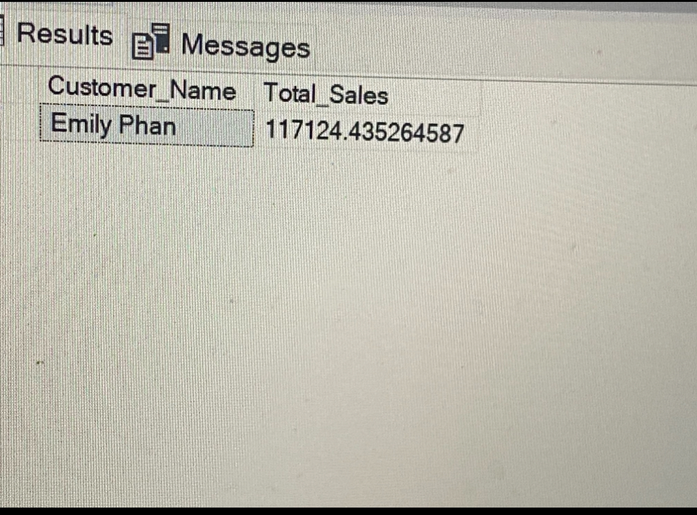

10. Customers that return their purchase
```sql
ALTER VIEW KMS_VIEW
AS
SELECT KMS_Inventory.Order_ID,
KMS_Inventory.Sales,
KMS_Inventory.Customer_Name,
KMS_Inventory.Customer_Segment,
KMS_Return_Order.[Status]
FROM KMS_Inventory
FULL OUTER JOIN KMS_Return_Order
ON KMS_Return_Order.Order_ID = KMS_Inventory.Order_ID

SELECT * FROM KMS_VIEW

SELECT DISTINCT Customer_Name, Customer_Segment [STATUS]
FROM KMS_VIEW
WHERE
[Status] = 'Returned'
```
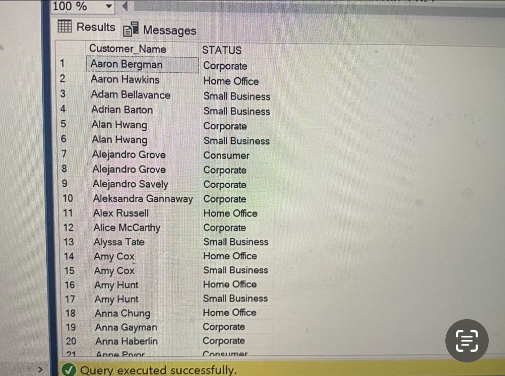

11. Did shipping method match order priority?
```sql
SELECT Ship_Mode,
Order_Priority,
COUNT(Order_ID) AS Order_Count,
SUM(Shipping_Cost) AS Total_Shipping_Cost,
AVG(Shipping_Cost) AS Average_Shipping_Cost
FROM KMS_Inventory
WHERE Ship_Mode IN ('Express Air', 'Delivery Truck')
GROUP BY Ship_Mode, Order_Priority
ORDER BY Ship_Mode, Order_Priority
```
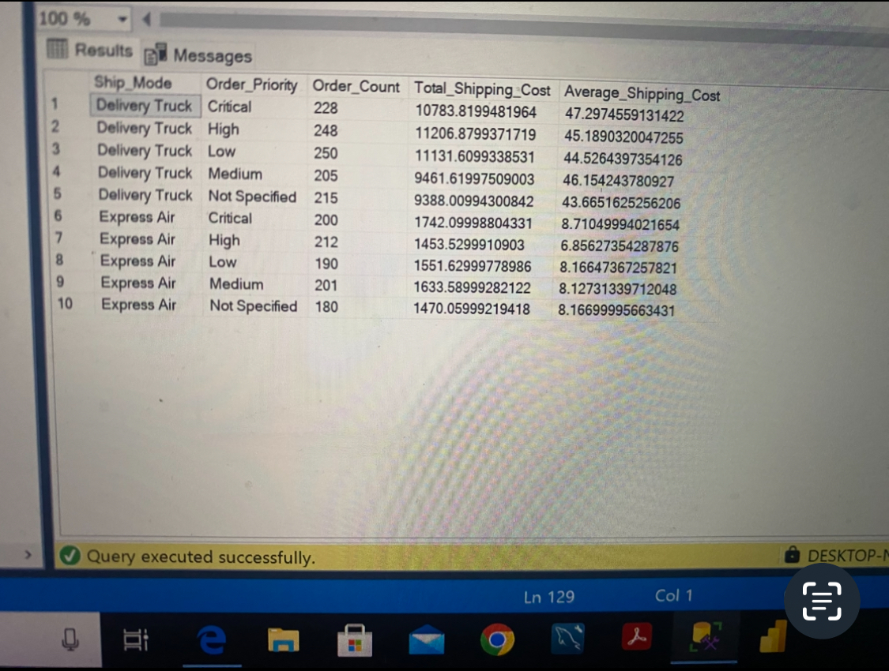

## 📊 Summary Report
1. Top-selling category: Technology=  5,984,248.175
2a. Top 3 regions: West, Ontario, Prarie
2b. Bottom 3 regions: Nuvanut, Northwest Territories, Yukon
3. Ontario Appliance Sales: 202,346.839630127
4. Bottom 10 customers: Jeremy Farry, Natalie DeCherney, Nicole Fjeld, Katrina Edelman, Dorothy Dickinson, Christine Kargatis, Eric Murdock, Chris McAfee, Rick Huthwaite, Mark Hamilton.
	* Recoomendations

		* Target Promotions and Discounts
	. Offer customized promotions or bundle deals to encourage repeat purchases, especially to those with only 1 or 2 orders.
	. Use email marketing to provide special loyalty discounts to these low-performing customers.
   
		* Upsell and Cross-sell
	. Suggest related or complementary products during checkout to increase basket size.
	. For example, if a customer buys a printer, offer printer ink, paper, or extended warranty.

		* Reduce Costs for Negative-Profit Customers
	. For customers with negative profit margins (e.g., Mark Hamilton, Chris McAfee):
	. Review shipping cost policies — maybe they’re getting free shipping on low-value orders.
	. Consider setting a minimum order amount for free delivery.

		*  Customer Feedback & Engagement
	. Reach out to these customers through surveys or calls to understand:

		* Improve Customer Experience
	. Consider adding value through better post-sale support, faster delivery, or reward points for future purchases.

5. Delivery Truck incurred the most shipping cost
6. Most valuable customers with goods and services they purchased
Emily Phan
Deborah Brumfield
Roy Skaria
Sylvia Foulston
Grant Carroll
7. Small business customer with the highest sale
	Dennis Kane; 75967.5932159424
8. Corporate Customers with the most number os orders in 2009 -2012
	Adam Hart; 19
9. Most profitable customer: 
	Emily Phan; 117124.435264587
10. We have total of 419 customers both consumer and corporate, that retunred goods during this period.
11. Express Air is definitly the most expensive, but looks the most fastest means of goods delivery and but Delivery trucks which is assumed economical is the slowest. i found out that over the years, delivery trucks incurred the most accrude shipping cost and the company have not been able to spend shipping cost based on priotiy orders. 


